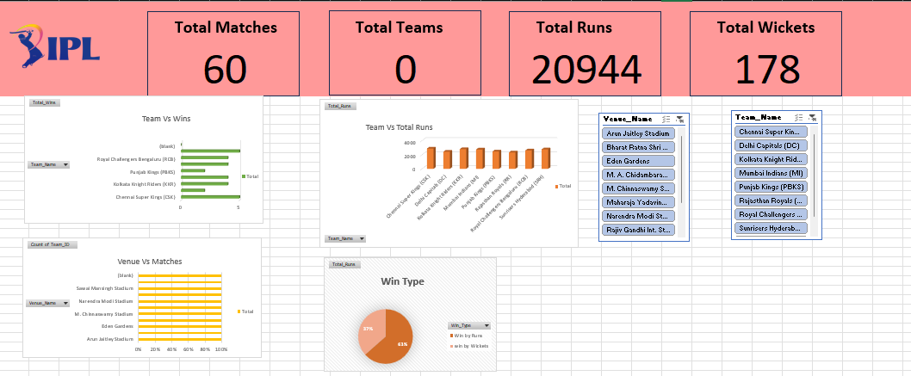
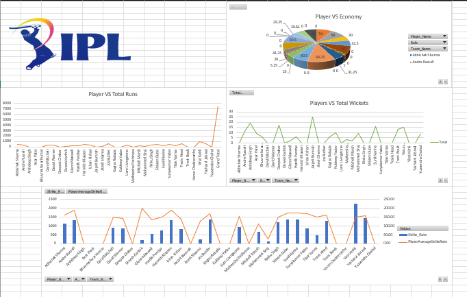

# 🏏 IPL Dashboard 2025

## 📊 Project Overview
This project is an interactive Excel dashboard built using IPL dataset.  
It helps analyze team and player performance using Pivot Tables, charts, and slicers.

---

## 🚀 Features
- 📌 Total Matches, Runs, Wickets overview
- 📌 Team-wise performance analysis
- 📌 Venue-wise match insights
- 📌 Player performance dashboard
- 📌 Interactive filters (slicers) for better analysis

---

## 🛠️ Tools Used
- Microsoft Excel
- Pivot Tables
- Charts
- Slicers

---

## 📷 Dashboard Preview

### 🟢 Team Performance Dashboard

### 🔵 Player Performance Dashboard

---

## 💡 Insights
- Teams performance varies significantly by venue
- Certain players dominate across multiple matches
- Match outcomes can be analyzed using filters dynamically

---

## 📂 Files Included
- `IPL Dashboard 2025.xlsx` → Main project file  
- `Team Dashboard.png` → Team dashboard preview  
- `Player Dashboard.png` → Player dashboard preview  

---

## 🎯 Purpose
This project was created to practice data analysis using Excel and build a portfolio-ready dashboard.

---

## 🙌 Author
**Nisha Choudhary**
